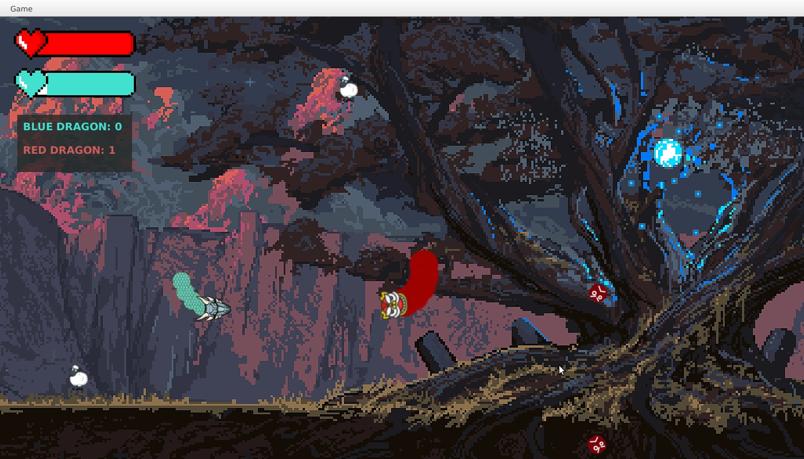

# Snake game

## Description

Snake game where two snakes can shoot eachother and powerups appear on the map, the competition between them is made by points, which appears on the score table, next to snakes life bars. Application made using Java and Maven.


## Development

### Inside IntelliJ Idea

   Open the project as a Maven project. (by opening the pom.xml)

   Run it from the maven sidebar by running 
   
    javafx:run <target>

### From command line

   Build it with

   ``` 
   mvn javafx:compile
```
    

   Run in with

   ```
mvn javafx:run
```
    

### The implementation


